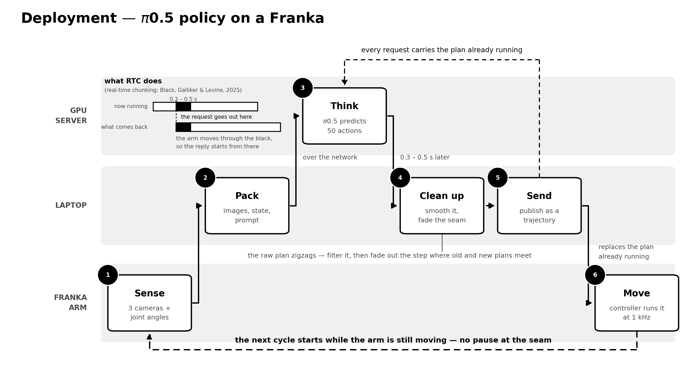
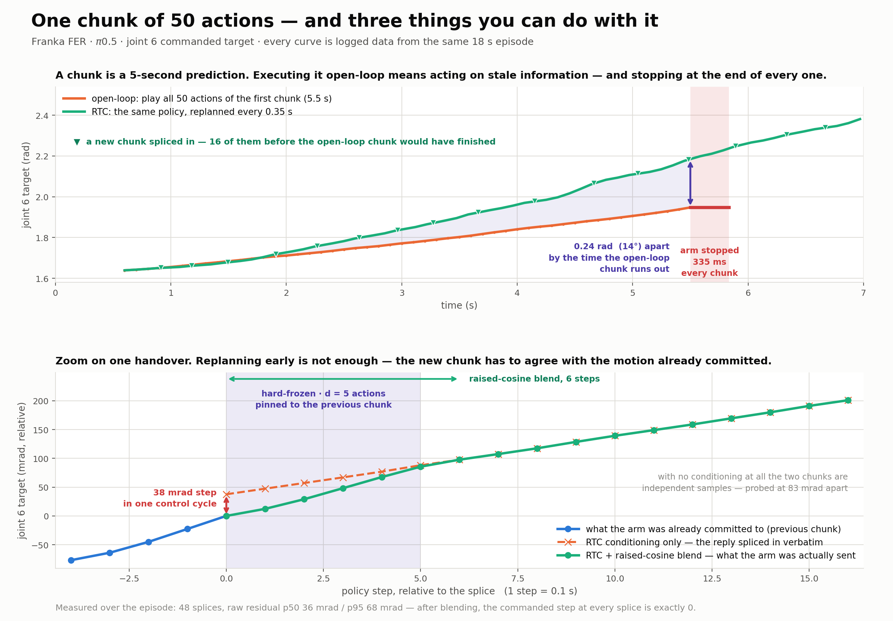

# franka_openpi

ROS 2 package that runs an [OpenPI](https://github.com/Physical-Intelligence/openpi) π0.5
policy on a **Franka FER / Panda** arm, with real-time chunking (RTC) so the arm never
stops between inference calls.



## Two pipelines

| Pipeline | Node | Executor | Behaviour |
|---|---|---|---|
| **RTC** (use this) | `openpi_rtc_node` | `rtc_executor` (JTC **topic**) | Fires the next inference while the arm is still moving, conditions it on the chunk being executed, splices the reply in. No stops. |
| **Blocking** (baseline) | `openpi_client_node` | `action_executor` (FollowJointTrajectory **action**) | Infer → execute chunk → stop → infer. Dead-stops at every chunk boundary. |

> **Never run both at once.** Both drive `fer_arm_controller`; a topic publish from
> `rtc_executor` pre-empts an active action goal.

## Quick start

```bash
ros2 launch franka_openpi openpi_franka_RTC.launch_sim.py \
  prompt:="pick up the mustard bottle" \
  step_duration:=0.1 \
  rtc_d:=5 \
  exec_horizon:=1 \
  rtc_d_margin:=3 \
  send_prev_actions:=true \
  auto_error_recovery:=true \
  splice_blend_steps:=6 \
  smooth_window:=15 \
  smooth_polyorder:=4 \
  joint_stiffness:="[1500.0, 1500.0, 1500.0, 1250.0, 1250.0, 1000.0, 1000.0]"
```

This is the tuned configuration for the sim-trained checkpoint on the real arm: 10 Hz
policy cadence, replan on every inference, 500 ms latency budget, Savitzky-Golay chunk
smoothing, 0.6 s splice blend, and ~50 % of libfranka's default joint stiffness.

Requires three things running elsewhere — see [Running](#running).

## Requirements

| Repo / package | Where | Why |
|---|---|---|
| this repo | laptop, `~/Franka/src/` | client, executors, launch files |
| [`franka-vision-guided-manipulation`](https://github.com/saifahmadgit/franka-vision-guided-manipulation) | laptop, same workspace | `omni_place` → `MotionPlanningInterface`, used for the gripper |
| [`openpi`](https://github.com/Physical-Intelligence/openpi) / [`openpi_franka`](https://github.com/saifahmadgit/openpi_franka) | GPU server | `scripts/serve_policy.py`; must be the RTC-capable build |
| `openpi-client` | laptop venv | `websocket_client_policy`, `msgpack_numpy`, `image_tools` |
| [`franka_ros2`](https://github.com/frankaemika/franka_ros2), `franka_description` | Franka PC + laptop | `fer_arm_controller`, `franka_msgs`, `franka_hardware` |
| `ros-jazzy-realsense2-camera` | laptop | three RealSense streams |
| `scipy`, `numpy`, `opencv-python`, `cv_bridge`, `matplotlib` | laptop | `savgol_filter` is a hard import |

### Install

```bash
cd ~/Franka/src
git clone https://github.com/saifahmadgit/openpi_franka_client franka_openpi
git clone https://github.com/saifahmadgit/franka-vision-guided-manipulation

cd ~/Franka
python3 -m venv .venv
.venv/bin/pip install openpi-client scipy numpy

colcon build --symlink-install
source install/setup.bash
```

Launch files prepend `~/Franka/.venv/lib/python3.12/site-packages` to `PYTHONPATH`. If
the workspace or Python version differs, fix `_VENV_SITE` at the top of the launch file.

## How RTC works

From Black, Galliker & Levine, *Real-Time Execution of Action Chunking Flow Policies*.
Three changes to the naive chunked loop:

1. **Never block on inference.** `rtc_executor` publishes to the controller's topic
   interface, which is fire-and-forget; JTC replaces whatever is running. The arm keeps
   playing the current chunk while the request is in flight.
2. **Fire early.** Request the next chunk at chunk index `s` (`exec_horizon`), not at `H`.
3. **Condition on what is executing.** Send the previous chunk back with the request,
   plus the index of the first unexecuted action, so the reply agrees with committed motion.

Given horizon `H`, execution horizon `s`, latency `d`, the new chunk splits into:

```
[0 ────── d) [d ────────── H-s) [H-s ────── H)
 hard-frozen   soft-masked        free
 pinned to     prefix-attends     unconstrained
 prev chunk    to prev chunk
```

`_mask_regions()` reports these at end of episode. **If `soft-masked == 0`, RTC is doing
nothing** — the discontinuity just moves from index 0 to index `d`. That happens at
`exec_horizon:=0`, kept only for comparison runs. With `exec_horizon:=1`, `H=50`, `d=5`:
hard 5, soft 44, free 1.



### Cycle

```
while steps_done < max_steps:
  1. sleep until _chunk_index() reaches fire_at = min(exec_horizon, H-d)
  2. s_req = _chunk_index(); fire inference on a worker thread
  3. poll for the reply  (chunk runs dry first → DROPPED DEADLINE, ratchet _d_floor)
  4. d_actual = _chunk_index() - s_req  (> d_sent → FROZEN REGION EXCEEDED, ratchet)
  5. _measure_splice() → _blend_splice() → _publish(chunk, offset=d_actual)
```

A reflex at any point clears RTC state and re-primes. `_chunk_index()` maps wall time
through the executor's `step_times`, not `elapsed / step_duration` — velocity limiting
stretches segments.

### Server contract

Sent on every non-priming call, all three together or not at all:

| Key | Type | Meaning |
|---|---|---|
| `prev_actions` | `(H, 14) float32` | previously commanded chunk, verbatim |
| `prev_actions_start` | `int` | index of the first unexecuted action |
| `prev_actions_d` | `int` | how many actions to freeze |

The reply should carry `rtc_active`, `rtc_d_eff`, `rtc_start`, `rtc_overlap`,
`rtc_prefix_attention_horizon`. `_record_rtc_flags` errors loudly if `rtc_active=False`
while `send_prev_actions:=true` — that means every splice is a raw discontinuity between
independent samples.

> ⚠️ The config uses `use_delta_joint_actions`: the model predicts offsets from the state
> sent on that call and the server adds state back before replying. The reply is therefore
> stored and returned **untouched at full (H, 14) width** — no slicing, no rebasing.
> Rebasing would pin the arm to targets stale by exactly the motion RTC exists to bridge.
> Only the execution path takes `[:, :8]`.

This server does soft **prefix attention**, not a hard freeze: at `prev_actions_d=18`
the frozen region still differs from the previous chunk by up to 0.030 rad (independent
samples differ by 0.083). `splice_blend_steps` absorbs the residual.

## Smoothing and splicing

Both problems below are **fixed amplitudes in radians**. Halving `step_duration` doubles
the velocity step and quadruples the acceleration — that is why 0.2 → 0.1 s needed them.

**Chunk smoothing** (`smooth_window`, `smooth_polyorder`) — the policy zigzags per action
(27 % of consecutive deltas reverse sign), which at 0.075 s/step exceeds `ACC_LIMIT` and is
felt as vibration. `_smooth_chunk` runs `savgol_filter` over columns `[:, :7]` of every
chunk, priming included, so consecutive chunks are filtered identically. Column 7 (gripper)
is excluded — it is thresholded to binary, so filtering only moves the crossing instant.
Window sizing is governed by the executed band (~indices `[d, 2d]`), not the whole chunk;
SG distortion lives at the edges, which are never reached. **Re-check if `exec_horizon`
goes above ~5.**

**Splice blending** (`splice_blend_steps`) — `old[s_reply]` and `new[d_actual]` name the
same instant, and their difference is the step in commanded target at the handover (p50
~0.022 rad, independent of `step_duration`). `_blend_splice` adds it back at the splice and
tapers to zero with a raised cosine; a linear ramp would leave a slope discontinuity at
both ends. It is shape-preserving — every action in the window shifts by the same decaying
offset. `_measure_splice` runs *before* the blend, so diagnostics report the raw jump.

**Catch-up segment** (`CATCHUP_MAX_SEC` in `rtc_executor.py`) — segment 0 spans measured
position → first commanded target, so it carries accumulated tracking error, not one policy
step. `_time_parameterize` sizes it by distance at the chunk's nominal speed, capped at an
**absolute** 0.6 s, and never slower than the arm is already moving (`v_now`).

**Terminal velocity must be zero.** `fer_arm_controller` silently discards a trajectory that
ends moving, so `_waypoint_velocities` zeroes the last waypoint — do not change it. The stop
costs nothing because the tail is replaced before the arm reaches it.

## Parameters

### RTC core

| Param | Launch default | Tuned | Meaning |
|---|---|---|---|
| `step_duration` | `0.2` | `0.1` | seconds per policy step; sets arm speed |
| `exec_horizon` (`s`) | `25` | `1` | chunk index at which the next inference fires; capped at `H-d`. Low = faster replan |
| `rtc_d` | `3` | `5` | inference latency in steps; `0` = adapt from observed round trips |
| `rtc_d_margin` | `2` | `3` | steps added when the `d` floor ratchets |
| `send_prev_actions` | `true` | `true` | `false` streams unconditioned chunks (ablation) |
| `max_steps` | `500` | — | policy steps played before the episode is cut off |
| `num_episodes` | `1` | — | episodes per run; RTC state is cleared between them |
| `prompt` | `"pick up the red object"` | task | language instruction |

### Smoothing / splicing

| Param | Default | Tuned | Meaning |
|---|---|---|---|
| `smooth_window` | `15` | `15` | Savitzky-Golay window over the 7 joint columns; `0`/`1` = off |
| `smooth_polyorder` | `3` | `4` | SG polynomial order; filter skipped if `window <= polyorder` |
| `splice_blend_steps` | `10` | `6` | raised-cosine decay length of the splice offset; `0` = verbatim |

### Images / transport

| Param | Default | Meaning |
|---|---|---|
| `image_size` | `0` | `0` = full resolution, server resizes (known-good). `224` pre-resizes and cuts the payload 2.77 MB → 0.45 MB, but is **only safe if the server resizes identically** — otherwise you stack two resamples |
| `two_front_cameras` | `true` | `true` = 3-camera (`cam_high`, `cam_left_wrist`, `cam_right_wrist`) |
| `server_host` / `server_port` | `129.105.69.11` / `8000` | hardcoded in the launch file; RTC uses **8000**, not 8001 |

### Gripper (sim RTC launch only)

Binary open/close, scheduled off the publish's `step_times`; transitions pending from a
replaced chunk are cancelled with the trajectory.

| Param | Default | Meaning |
|---|---|---|
| `gripper_open_width` | `0.08` | open aperture, m. **Biggest lever on cycle time** — every transition pays for the travel between open and close width |
| `gripper_close_width` | `0.02` | closed aperture, m |
| `gripper_open_speed` | `0.1` | width rate, m/s (Franka Hand's rated max) |
| `gripper_close_speed` | `0.1` | width rate, m/s. Uses `Move` with `adaptive_stop=False`, so faster meets the object harder — **lower this first if contact trips the reflex** |
| `gripper_close_threshold` | `0.03` | where the policy's gripper column (m, ~0 closed to 0.04 open) is binarised. Raising it fires the close earlier in the ramp-down |
| `gripper_hysteresis` | `0.0` | Schmitt band around the threshold; raise only if the gripper chatters |
| `gripper_lead_time` | `0.0` | seconds each transition fires early, covering the `Move` round trip plus finger travel. That cost is fixed in wall clock and does not shrink with `step_duration`, so this is the only knob that moves the grasp instant |

### Compliance (sim RTC launch only)

| Param | Default | Tuned | Meaning |
|---|---|---|---|
| `joint_stiffness` | `[600,600,600,600,250,150,50]` | `[1500,1500,1500,1250,1250,1000,1000]` | libfranka joint-impedance stiffness, Nm/rad (libfranka default is `[3000…2000]`). `"[]"` leaves the robot alone |
| `collision_torque` | `[40,40,38,36,32,28,24]` | — | per-joint reflex torque thresholds, Nm |
| `collision_force` | `[40,40,40,50,50,50]` | — | Cartesian reflex thresholds (x y z r p y) |
| `auto_error_recovery` | `true` | `true` | clear a reflex and re-prime instead of stalling. **Keep on** — the arm ignores commands in `ROBOT_MODE_REFLEX` and the topic interface is fire-and-forget |

Compliance is applied once at startup, after the controller is up but before motion. These
are runtime settings on the robot, not ROS parameters, so they are lost on every
`franka_hardware` restart and re-pushed each launch. With mock hardware every call degrades
to a warning. Reflex recovery discards RTC state and re-primes from scratch — splicing
against the pre-reflex chunk would splice against actions the arm never reached.

### Velocity / acceleration limits (constants in `action_executor.py`)

```python
ENFORCE_LIMITS = True
_LIMIT_SCALE   = 0.5                     # fraction of Franka's official limits
VEL_LIMIT = [2.175]*4 + [2.61]*3  × 0.5  # rad/s
ACC_LIMIT = [15, 7.5, 10, 12.5, 15, 20, 20] × 0.5  # rad/s²
```

Segment durations only stretch, never shrink below `step_duration`.

## Running

**1. Policy server (GPU box)**

```bash
CUDA_VISIBLE_DEVICES=1 XLA_PYTHON_CLIENT_PREALLOCATE=false \
python scripts/serve_policy.py \
  --default_prompt "pick up the mustard bottle" \
  --port 8000 \
  policy:checkpoint \
  --policy.config pi05_magicsim_apple_red \
  --policy.dir checkpoints/pi05_magicsim_apple_red/magicsim_apple_lora_red/55000
```

**2. Franka PC**

```bash
source ~/ros2_ws/install/setup.bash
ros2 launch franka_moveit_config moveit.launch.py robot_ip:=<ROBOT_IP>
```

**3. Laptop — MoveIt / gripper interface**

```bash
source ~/Franka/install/setup.bash
ros2 launch omni_place omni_place.launch.py
```

**4. Laptop — cameras + RTC client**

```bash
source ~/Franka/install/setup.bash
ros2 launch franka_openpi openpi_franka_RTC.launch_sim.py <args from Quick start>
```

### Launch files

| File | Checkpoint | Camera serials | Params exposed |
|---|---|---|---|
| `openpi_franka_RTC.launch_sim.py` | sim-trained | front_1/front_2 **swapped** | all (smoothing, splice, gripper, compliance) |
| `openpi_franka_RTC.launch.py` | real-data | dataset order | core RTC only |
| `openpi_franka.launch_sim.py` | sim-trained | swapped | blocking baseline |
| `openpi_franka.launch.py` | real-data | dataset order | blocking baseline |

The node declares every parameter regardless, so the non-sim launches fall back to node
defaults. To expose a knob there, copy the `DeclareLaunchArgument` and matching
`LaunchConfiguration` entries across.

## Cameras

Three RealSense D4xx at 640×480×30, colour only.

| Namespace | RTC **sim** serial | RTC **real** serial | Server key (3-cam) | (2-cam) |
|---|---|---|---|---|
| `camera/front_1` | `342522070195` | `938422076779` | `cam_left_wrist` | `cam_high` |
| `camera/front_2` | `938422076779` | `342522070195` | `cam_right_wrist` | — |
| `camera/wrist` | `347622076595` | `347622076595` | `cam_high` | `cam_left_wrist` |

> **Do not "fix" the mapping by name.** `cam_high ← wrist` matches how training filled the
> keys (`cam_high` is the mandatory `base_0_rgb` slot). The sim launch additionally swaps
> front_1/front_2 because the sim checkpoint's `front_1` key learned the right-side view.
> `tools/openpi_replay.py --swap-front` settles this offline against training frames.

`serial_no` must be wrapped in `ParameterValue(..., value_type=str)` — a bare numeric
string is coerced to an int and rejected. `camera_viewer` runs alongside for a live view.

## Wire format

**Observation → server**

```python
{
  "state":  np.float32[9],          # fer_joint1..7 + finger_joint1 + finger_joint2
  "images": {                       # CHW uint8, full resolution unless image_size > 0
      "cam_high": ..., "cam_left_wrist": ..., "cam_right_wrist": ...,
  },
  "prompt": str,
  # non-priming calls only:
  "prev_actions": np.float32[H, 14],
  "prev_actions_start": int,
  "prev_actions_d": int,
}
```

State is **9-dim, not 8** — the checkpoint's `norm_stats` are 9-dim and sending 8
mis-aligns normalization. Inference is gated on a real `/joint_states` message: zeros are
not a safe placeholder, because the server re-adds state to its delta prediction and the
all-zero pose points the arm straight up.

**Actions ← server** — `(H, 14) float32` absolute joint targets, `H` typically 50:

```
[:, 0:7]   arm joint targets (rad)   ← smoothed, blended, executed
[:, 7]     gripper                   ← thresholded, binary
[:, 8:14]  padding                   ← untouched, kept for the wire round-trip
```

## Diagnostics

### End-of-episode report

```
RTC timing
  round trip  p50 ... ms   p95 ... ms   max ... ms  (N calls)
  server_timing.infer_ms  p50 ...  p95 ...   <- real model time
  policy_timing.infer_ms  p50 ...          (JAX dispatch only -- reads far low)
  d observed  p50 ...  max ... steps  (d sent ..., firing at index ... of ...)
  RTC regions  hard-frozen ...  soft-masked ...  free ...
  splice jump  p50 ...  p95 ...  max ... rad  (N splices)
  dropped deadlines / collision reflexes recovered / frozen-region violations
```

| Reading | Meaning | Action |
|---|---|---|
| `policy_timing` ≪ `server_timing` | expected — `policy_timing` times async JAX dispatch only | none |
| `soft-masked == 0` | RTC is relocating the discontinuity, not removing it | lower `exec_horizon` |
| `splice jump` | step change in commanded target at each handover, on the raw reply — the headline metric | compare before/after server changes |
| `dropped deadlines > 0` | chunk ran dry with inference in flight; arm holds its last action | raise `rtc_d`, lower `exec_horizon`, or shrink the payload |
| `frozen-region violations > 0` | spliced inside actions the server never pinned; visible jerk | self-heals via `_d_floor`, but the first is felt |
| `collision reflexes > 0` | contact | lower `joint_stiffness`, raise `collision_torque`, or lower `gripper_close_speed` |

### Debug files

Written to `debug/rtc/` on exit, prefixed by `debug_tag` (`rtc_sim_` / `rtc_`):

| File | Contents |
|---|---|
| `*_actual.npy`, `*_actual_times.npy` | measured joints `[:8]` at the driver's native ~1.4 kHz, monotonic timestamps. Deliberately not fixed-tick — a `step_duration` tick aliases away the 10–50 Hz band vibration lives in |
| `*_commanded.npz` | per publish: `t_k`, `offset_k`, `step_times_k`, `actions_k` (ragged, hence npz) |
| `*_rtt.npy` | every round trip, including the JIT-warm first call |
| `*_splice_jumps.npy`, `*_splice_meta.npy` | per-joint jump `(n, 7)` and `(s_req, s_reply, d_actual, i_old, i_new)` |

Nothing is plotted during a run — the blocking pipeline's in-loop figures cost 1.3–1.5 s
of dead time per chunk.

### Tools

None of these create an action client, so none can move the arm.

```bash
# Logic check: index math, splice offsets, wire format. Stubs ROS and the websocket.
python3 tools/rtc_logic_check.py

# Round-trip latency probe → pick rtc_d. --synthetic if cameras are down.
python3 tools/openpi_latency.py --port 8000 --n 40 --step-hz 10 --horizon 50 --tag sim

# One-shot pipeline check against a frozen live observation. Cameras up, client node DOWN.
python3 tools/openpi_sanity.py --prompt "pick up the mustard bottle"

# Replay a TRAINING frame through the live server — separates a broken pipeline from the
# sim-to-real visual gap, and settles the front-camera swap. Needs pyarrow.
~/Franka/.venv/bin/python tools/openpi_replay.py --episode 0 --frame 120 [--swap-front]

# Live plot of the debug .npy files during a run.
python3 franka_openpi/plot_debug_live.py --debug_dir ~/Franka/src/franka_openpi/debug
```

The first three need `PYTHONPATH=~/Franka/.venv/lib/python3.12/site-packages:$PYTHONPATH`.

## Troubleshooting

| Symptom | Cause | Fix |
|---|---|---|
| `No subscriber on /fer_arm_controller/joint_trajectory after 15s` | controller not active | `ros2 control list_controllers`; check `ROS_DOMAIN_ID` / DDS |
| `Server reports rtc_active=False` | server build lacks RTC, or rejects the `prev_actions_*` keys | use the RTC-capable `serve_policy.py` |
| Arm moves, then nothing, silently | trajectory rejected — final point had non-zero velocity | do not touch `_waypoint_velocities` |
| Arm stalls mid-episode, log looks normal | collision reflex; the loop keeps splicing into a stationary arm | `auto_error_recovery:=true` |
| Vibration at faster cadence | chunk zigzag; acceleration scales as 1/step_duration² | raise `smooth_window` (15/4 is tuned) |
| One jerk per handover | unabsorbed server residual, or frozen-region violation | raise `splice_blend_steps`, raise `rtc_d` |
| Lurch-then-crawl at every republish | catch-up segment mis-timed | check `CATCHUP_MAX_SEC` is absolute (0.6 s) and `/joint_states` carries `velocity` |
| Gripper fires late | fixed wall-clock `Move` + travel cost | raise `gripper_lead_time`, then `gripper_close_threshold` |
| Object dropped mid-carry | stale release from a superseded chunk | already handled — `_schedule_gripper` cancels before the empty check |
| `Not ready after 10 s` | a camera or `/joint_states` never arrived | the message names which |
| `parameter not set` on `joint_stiffness:="[]"` | empty YAML list has no element type | already handled — treated as "leave the robot alone" |
| Compliance services time out | `franka_hardware` not up (mock hardware) | warning only; arm keeps its current stiffness |
| `ModuleNotFoundError: openpi_client` | venv path wrong | fix `_VENV_SITE` in the launch file |
| `ModuleNotFoundError: omni_place` | `franka-vision-guided-manipulation` not built | `colcon build` it in the same workspace |
| Websocket dies mid-inference | 20 s keepalive ping fires during a long inference | already handled — `_NoPingPolicy` disables pings |

## Layout

```
franka_openpi/
├── franka_openpi/
│   ├── openpi_rtc_node.py      ← RTC client: obs packing, d/s scheduling, smoothing,
│   │                             splice blending, diagnostics.  Main file.
│   ├── rtc_executor.py         ← streaming executor: JTC topic publish, time
│   │                             parameterization, catch-up sizing, gripper scheduling
│   ├── openpi_client_node.py   ← blocking baseline client
│   ├── action_executor.py      ← blocking executor + shared limits/gripper/constants
│   ├── robot_compliance.py     ← stiffness, collision thresholds, reflex recovery
│   ├── camera_viewer.py        ← live view of the three streams
│   ├── plot_debug_live.py      ← watch debug/*.npy, regenerate the PNG
│   ├── groot_client_node.py    ← GR00T policy variant
│   ├── act_client_node.py      ← ACT policy variant
│   └── hand_eye_calibrate.py
├── launch/                     ← RTC + blocking, sim + real; cameras; ACT / GR00T
├── tools/                      ← rtc_logic_check, openpi_latency, openpi_sanity, openpi_replay
├── docs/                       ← figures and the scripts that generate them
└── debug/                      ← run artefacts (rtc/, latency/, sanity/)
```

`rtc_executor` composes an `ActionExecutor` purely for the gripper path, so both pipelines
share one definition of the thresholding rule; its `FollowJointTrajectory` client is created
but never used. Nothing in `action_executor.py` is modified by the RTC path.
